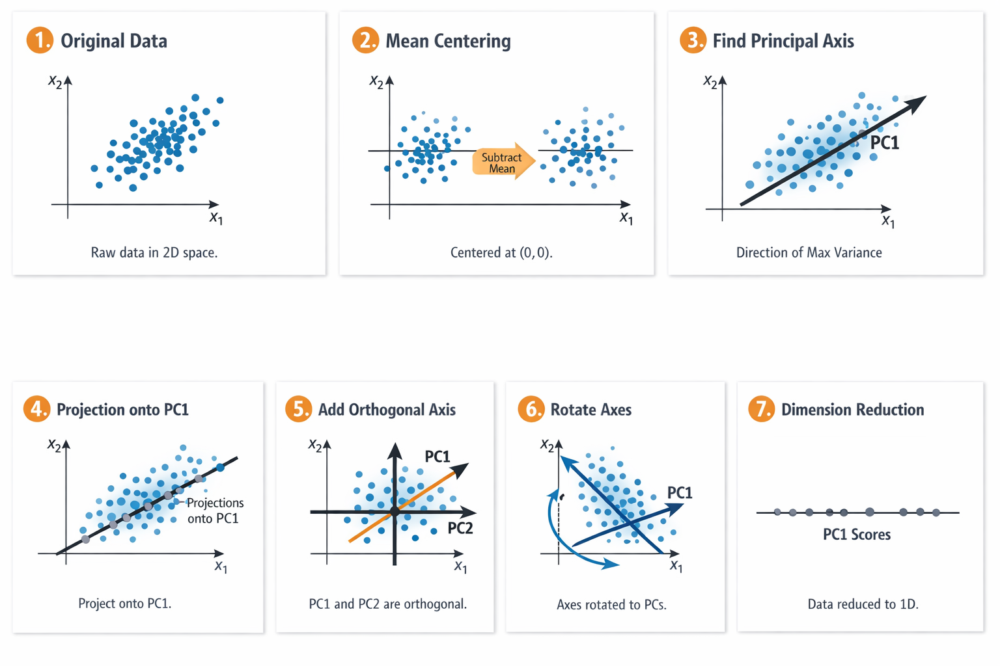
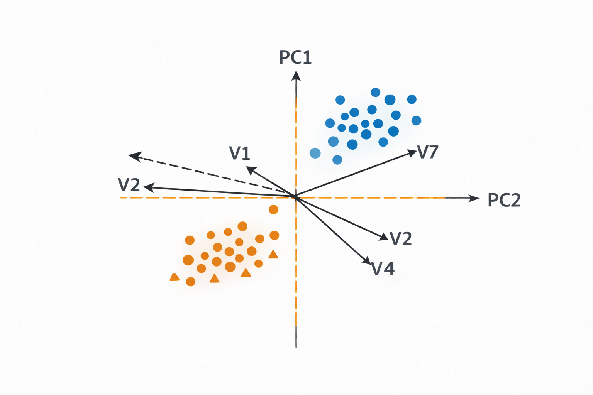
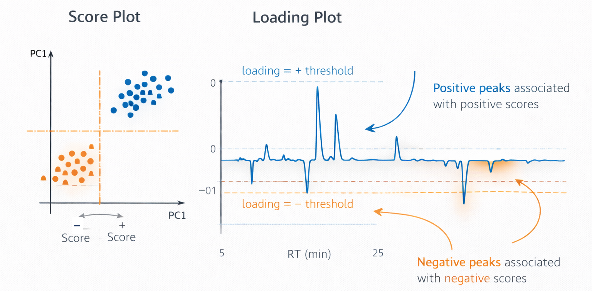
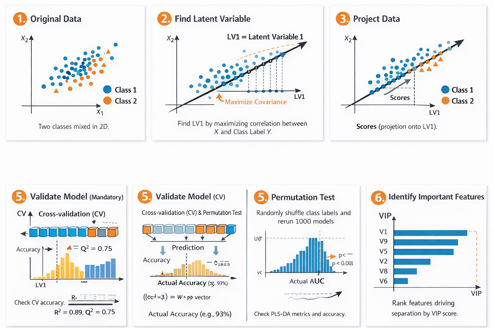

# Multivariate Data Analysis – Detailed Teaching Guide

> This document is designed as a conceptual and practical guide for students learning multivariate data analysis in metabolomics and related biological sciences.

---

# 1️⃣ What Is Multivariate Data?

## Definition: Variable

A **variable** (also called a feature) is a measurable quantity.

Examples:

* Metabolite intensity
* Peak area
* Gene expression value
* NMR bucket

---

## Definition: Sample

A **sample** is one observation containing many variables.

In metabolomics:

* One injection
* One biological replicate
* One individual

---

## Definition: Multivariate Data

Data are **multivariate** when each sample contains multiple variables.

Mathematically:

If we have:

* *n* samples
* *p* variables

Then our dataset is an **n × p matrix**.

Each sample is a point in **p-dimensional space**.

---

## Why Multivariate Analysis?

Univariate analysis:

* Tests one variable at a time.

Multivariate analysis:

* Considers all variables simultaneously.
* Accepts the fact that different variable affects the system in combinations.
* Interactions among different variables.
* Detects patterns that only emerge in combination.

In biology:

> Most biological phenomena are not driven by a single variable, but by coordinated changes.

---

# 2️⃣ Data Structure and Format

## Data Matrix Structure

We typically organize data as:

| Feature ↓ / Sample → | S1  | S2  | S3  | S4  |
| -------------------- | --- | --- | --- | --- |
| Metabolite 1         | x11 | x12 | x13 | x14 |
| Metabolite 2         | x21 | x22 | x23 | x24 |

---

## Definition: Data Matrix

A **data matrix** is a rectangular table of numeric values representing measurements.

Notation:

* X = data matrix
* xᵢⱼ = value of feature i in sample j

---

## Group Labels

When working with experimental groups:

* Control
* Treated
* Disease
* Healthy

These labels are stored separately (e.g., `ATTRIBUTE_class`).

Important:

> Group labels are not used in unsupervised methods.

---

# 3️⃣ Data Inspection

Before any transformation:

## Definition: Exploratory Data Analysis (EDA)

EDA is the process of examining data to understand:

* Distribution
* Missingness
* Outliers
* Variability

---

## Definition: Distribution

A **distribution** describes how values are spread across a range.

Common properties:

* Symmetry
* Skewness
* Presence of extreme values

Metabolomics data are often:

* Right-skewed
* Heteroscedastic

---

## Definition: Heteroscedasticity

Heteroscedasticity means:

> The variance changes with the mean.

Large peaks tend to have larger variance.

This is one reason transformations are applied.

---

# 4️⃣ Missing Values

## Definition: Missing Value

A missing value is an observation that has no recorded numeric value.

Represented as:

* NA
* null
* empty cell

---

## Why Missing Values Occur

* Below detection limit
* Peak detection failure
* Alignment failure
* True biological absence

---

## Definition: Missingness Mechanisms

There are three conceptual types:

1. MCAR – Missing Completely At Random
2. MAR – Missing At Random
3. MNAR – Missing Not At Random

In metabolomics, missingness is often MNAR (low abundance).

---

## Imputation

### Definition: Imputation

Imputation is the process of replacing missing values with estimated values.

---

### Common Imputation Methods

#### Mean Imputation

Replace missing values with the average of observed values.

Effect:

* Reduces variance artificially.

#### Median Imputation

Replace missing values with the median.

More robust to outliers.

#### Constant Imputation

Replace missing values with zero or small value.

Assumes missing = absence.

---

# 5️⃣ Transformation

## Definition: Data Transformation

A mathematical operation applied to data to change its scale or distribution.

---

## Log Transformation

### Definition

Log transformation replaces each value x with log(x).

Common base:

* log10
* natural log (ln)

---

### Why Use Log?

Log compresses large values more than small values.

Example:

* log(1000) vs log(10)
* Difference becomes smaller.

Effect:

* Reduces skewness
* Reduces heteroscedasticity

---

## Important Concept: Monotonic Transformation

Log transformation is monotonic:

* Order of values is preserved.
* Relative ranking remains the same.

---

# 6️⃣ Normalization

## Definition: Normalization

Normalization adjusts values across samples to make them comparable.

It corrects systematic sample-to-sample differences.

---

## Types of Normalization

### Total Sum Normalization

Each sample is divided by its total intensity.

Purpose:

* Correct injection differences.

---

### Internal Standard Normalization

Each feature is divided by the signal of a reference compound.

More chemically meaningful.

---

### PQN (Probabilistic Quotient Normalization)

Common in NMR.
Adjusts based on median fold change.

---

## Important Distinction

Normalization acts across samples.

Scaling acts across variables.

These are different operations.

---

# 7️⃣ Scaling

## Definition: Scaling

Scaling adjusts the variance of variables so that they contribute equally (or more equally) to the model.

---

## Mean-Centering

### Definition

Subtract the mean of each variable.

Formula:

$$
xᵢⱼ → xᵢⱼ − mean(xᵢ)
$$

Effect:

* Data centered around zero.

---

## Autoscaling (Unit Variance Scaling)

### Definition

Subtract mean and divide by standard deviation.

Formula:

$$
xᵢⱼ → (xᵢⱼ − mean(xᵢ)) / sd(xᵢ)
$$

Effect:

* All variables have variance = 1.

---

## Pareto Scaling

Divide by square root of standard deviation.

Compromise between no scaling and autoscaling.

---

## Why Scaling Matters

Without scaling:

* High-intensity metabolites dominate PCA.

With scaling:

* Small metabolites gain influence.

Scaling is a modeling decision.

---

# 8️⃣ PCA (Principal Component Analysis)

## Definition

PCA is an unsupervised dimensionality reduction method.

It finds linear combinations of variables that capture maximal variance.

---

## Definition: Principal Component

A principal component is:

> A weighted linear combination of original variables.

$$
PC1 = w1x1 + w2x2 + ... + wpxp
$$

Weights are chosen to maximize variance.

---

## Definition: Variance

Variance measures how spread out data are.

High variance = large dispersion.

PCA captures directions of maximum variance.

---

## Scores and Loadings

### Score

Coordinates of samples in PC space.

Represent:

* Samples
  
---

### Loading

Weights that define each principal component.

Represent:

* Variable contributions

* 

*
---

## Orthogonality

Principal components are orthogonal:

* They are statistically independent.
* Dot product = 0.

---

# 9️⃣ Supervised Methods

## Definition: Supervised Learning

A method that uses known class labels during model training.

Example:

* PLS-DA

---

## PLS-DA

### Definition

Partial Least Squares Discriminant Analysis.

A regression-based method adapted for classification.

It finds components that:

* Maximize covariance between X (data) and Y (class labels).

*

---

## Covariance

Covariance measures how two variables vary together.

High covariance:

* When one increases, the other tends to increase.

PLS-DA maximizes covariance between features and class membership.

---

# 🔟 Model Evaluation

## R²

Explained variance.

Measures how well model fits training data.

---

## Q²

Predictive ability estimated by cross-validation.

Measures generalizability.

---

## Overfitting

### Definition

Overfitting occurs when a model learns noise instead of signal.

Characteristics:

* Excellent training performance
* Poor prediction performance

---

## Cross-Validation

Repeatedly splitting data into training and test subsets.

Purpose:

* Estimate model robustness.

---

## Permutation Test

Randomly shuffle class labels and refit model.

If shuffled model performs similarly:

* Original model not meaningful.

---

# 1️⃣1️⃣ VIP (Variable Importance in Projection)

## Definition

VIP quantifies how much each variable contributes to class separation in PLS-DA.

Common rule:
VIP > 1 = important.

But this is heuristic, not absolute truth.

---

# 1️⃣2️⃣ Outliers

## Definition

An outlier is a sample that deviates strongly from others.

Possible causes:

* Biological uniqueness
* Experimental error
* Instrumental issue

Outliers must be investigated, not blindly removed.

---

# 1️⃣3️⃣ Dimensionality Reduction

## Definition

Reducing number of variables while retaining essential information.

Original dimension = p
Reduced dimension = k (k << p)

Benefits:

* Visualization
* Noise reduction
* Computational efficiency

---

# 1️⃣4️⃣ Biological Interpretation

Statistics detect structure.

Interpretation assigns meaning.

Ask:

* Are discriminant features chemically related?
* Do they share biosynthetic pathways?
* Do they match phenotype?

Multivariate analysis:

> Is a structured way of asking better biological questions.

---

# 📌 Final Teaching Principle

Students must understand:

* Every preprocessing step is a modeling decision.
* Every transformation changes the geometry of the data.
* Every supervised model must be validated.
* Multivariate analysis reveals patterns — it does not create truth.

---

