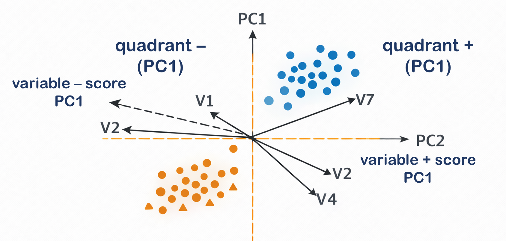

# Block 1 — Mathematical Foundations (Matrix Notation) of PCA

> This section formalizes the main operations used in multivariate analysis using matrix notation.

---

## 1️⃣ The Data Matrix

Let:

* ( n ) = number of samples
* ( p ) = number of variables

We define the data matrix:

$$
\mathbf{X} \in \mathbb{R}^{n \times p}
$$

$$
\mathbf{X} =
\begin{bmatrix}
x_{11} & x_{12} & \dots & x_{1p} \\\\
x_{21} & x_{22} & \dots & x_{2p} \\\\
\vdots & \vdots & \ddots & \vdots \\\\
x_{n1} & x_{n2} & \dots & x_{np}
\end{bmatrix}
$$

* Rows = samples
* Columns = variables

Each row is a vector in ( \mathbb{R}^p ).

---

## 2️⃣ Mean-Centering

The mean of variable ( j ):

$$
\bar{x}_j = \frac{1}{n} \sum_{i=1}^{n} x_{ij}
$$

Mean-centered data:

$$
x'*{ij} = x*{ij} - \bar{x}_j
$$

Matrix form:

$$
\mathbf{X}_c = \mathbf{X} - \mathbf{1}\bar{\mathbf{x}}^T
$$

where:

* ( \mathbf{1} ) is a column vector of ones
* ( \bar{\mathbf{x}} ) is the vector of variable means

---

## 3️⃣ Autoscaling (Unit Variance Scaling)

Standard deviation of variable ( j ):

$$
s_j = \sqrt{\frac{1}{n-1} \sum_{i=1}^{n} (x_{ij} - \bar{x}_j)^2}
$$

Scaled value:

$$
x''*{ij} = \frac{x*{ij} - \bar{x}_j}{s_j}
$$

Matrix form:

$$
\mathbf{X}_{scaled} = \mathbf{X}_c \mathbf{D}^{-1}
$$

Where:

* ( \mathbf{D} ) = diagonal matrix of standard deviations

---

## 4️⃣ Covariance Matrix

The covariance matrix:

$$
\mathbf{S} = \frac{1}{n-1} \mathbf{X}_c^T \mathbf{X}_c
$$

Dimensions:

$$
\mathbf{S} \in \mathbb{R}^{p \times p}
$$

Interpretation:

* Diagonal elements → variances
* Off-diagonal elements → covariances

---

## 5️⃣ PCA as Eigen Decomposition

PCA finds eigenvectors of the covariance matrix:

$$
\mathbf{S} \mathbf{v}_k = \lambda_k \mathbf{v}_k
$$

Where:

* ( \mathbf{v}_k ) = eigenvector (loading vector)
* ( \lambda_k ) = eigenvalue (variance explained)

Principal components are ordered:

$$
\lambda_1 \ge \lambda_2 \ge \dots \ge \lambda_p
$$

---

## 6️⃣ Scores

Scores are projections of data onto eigenvectors:

$$
\mathbf{T} = \mathbf{X}_c \mathbf{V}
$$

Where:

* ( \mathbf{V} ) = matrix of eigenvectors
* ( \mathbf{T} ) = score matrix

Each column of ( \mathbf{T} ) is a principal component.

---

## 7️⃣ Variance Explained

Proportion of variance explained by PC k:

$$
\frac{\lambda_k}{\sum_{j=1}^{p} \lambda_j}
$$

---

## 8️⃣ PLS-DA Concept (Matrix Form)

PLS models:

$$
\mathbf{X} = \mathbf{T}\mathbf{P}^T + \mathbf{E}
$$
$$
\mathbf{Y} = \mathbf{T}\mathbf{C}^T + \mathbf{F}
$$

Where:

* ( \mathbf{T} ) = latent scores
* ( \mathbf{P} ) = loadings for X
* ( \mathbf{C} ) = loadings for Y
* ( \mathbf{E}, \mathbf{F} ) = residuals

PLS maximizes covariance between ( \mathbf{X} ) and ( \mathbf{Y} ).

---
---

# 📐 Block 2 — Conceptual Geometry of Multivariate Analysis

> Understanding geometry helps students truly grasp PCA and PLS-DA.

---

## 1️⃣ Samples as Points in Space

If we have:

* 2 variables → 2D space
* 3 variables → 3D space
* p variables → p-dimensional space

Each sample is a point.

Distance between samples represents similarity.

---

## 2️⃣ What PCA Really Does (Geometrically)

PCA:

* Rotates the coordinate system
* Finds new axes
* Aligns axes with directions of maximum variance

It does NOT move the data.
It rotates the space.

---

---

## 3️⃣ Projection

### Definition: Projection

Projection means dropping a perpendicular from a point onto a line or plane.

In PCA:

Each sample is projected onto a principal component axis.

The projection value = score.

---

## 4️⃣ Hyperplanes

### Definition: Hyperplane

A hyperplane is:

* A line in 2D
* A plane in 3D
* A (p−1)-dimensional surface in p dimensions

In supervised learning:

PLS-DA tries to find a hyperplane separating classes.

---

## 5️⃣ Separation as Geometry

If two groups are separable:

* There exists a direction in space
* Along which projections differ

If no such direction exists:

* Groups overlap in multidimensional space

---

## 6️⃣ Orthogonality

Principal components are perpendicular (orthogonal).

This ensures:

* No redundant variance
* Independent directions

---

## 7️⃣ Distance and Similarity

Common distance measure:

$$
d(x_i, x_j) = \sqrt{\sum_{k=1}^{p}(x_{ik} - x_{jk})^2}
$$

This is Euclidean distance.

Small distance → similar samples.

---

## 8️⃣ Overfitting Geometrically

Overfitting means:

* Drawing a very complex boundary
* That perfectly separates training data
* But fails on new data

Geometrically:

The hyperplane becomes too sensitive to noise.

---

---

# 🚨 Block 3 — Common Misconceptions in Multivariate Analysis

> This section is critical for teaching.

---

## ❌ Misconception 1: “If PCA separates groups, it proves biology.”

Reality:

PCA shows variance structure, not causality.

Separation may be due to:

* Batch effect
* Instrument drift
* Scaling artifact

---

## ❌ Misconception 2: “PLS-DA separation means strong predictive power.”

Reality:

PLS-DA always tries to separate groups.

Without cross-validation:

* It is meaningless.

---

## ❌ Misconception 3: “VIP > 1 means biomarker.”

Reality:

VIP indicates contribution to model.

It does NOT guarantee:

* Statistical significance
* Biological relevance
* Reproducibility

---

## ❌ Misconception 4: “Scaling is just cosmetic.”

Reality:

Scaling changes the geometry of the data space.

Different scaling → different PCA directions.

---

## ❌ Misconception 5: “Removing outliers improves model quality.”

Reality:

Outliers may contain real biology.

Removing them artificially improves separation.

---

## ❌ Misconception 6: “Higher R² always means better model.”

Reality:

R² measures fit.

Q² measures prediction.

A high R² with low Q² = overfitting.

---

## ❌ Misconception 7: “Multivariate analysis finds truth.”

Reality:

It finds patterns.

Interpretation requires:

* Biological reasoning
* Experimental validation
* Replication

---

## ❌ Misconception 8: “More components = better model.”

Reality:

Each additional component risks fitting noise.

Model complexity must be justified.

---

# 🎓 Final Teaching Message

Multivariate analysis is:

* Linear algebra
* Geometry
* Statistics
* Modeling philosophy

Students must understand:

> Every preprocessing choice reshapes the mathematical space.
> Every model is a projection of reality.
> Interpretation is a scientific responsibility.

